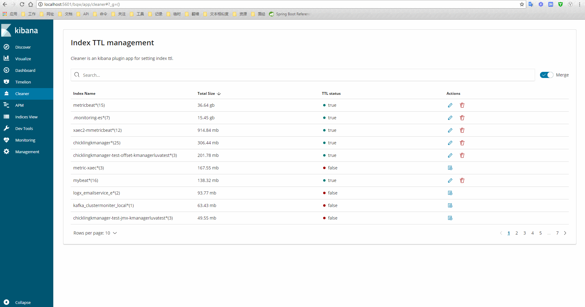

# Cleaner

> An awesome Kibana plugin for setting elasticsearch index ttl

---

## screenshots



## config
1. scheduleTime

    server job schedule period,unit second ,default value is 60 second.

    you can edit it. like: ```cleaner.scheduleTime: 100```
2. mergePattern

    merge pattern,default value is ```[^a-z]+$```.

    you can edit it. like: ```cleaner.mergePattern: '[\d]{4}[-|\.|/][\d]{1,2}[-|\.|/][\d]{1,2}'```

## development

See the [kibana contributing guide](https://github.com/elastic/kibana/blob/master/CONTRIBUTING.md) for instructions setting up your development environment. Once you have completed that, use the following npm tasks.

  - `npm start`

    Start kibana and have it include this plugin

  - `npm start -- --config kibana.yml`

    You can pass any argument that you would normally send to `bin/kibana` by putting them after `--` when running `npm start`

  - `npm run build`

    Build a distributable archive

  - `npm run test:browser`

    Run the browser tests in a real web browser

  - `npm run test:server`

    Run the server tests using mocha

For more information about any of these commands run `npm run ${task} -- --help`.
